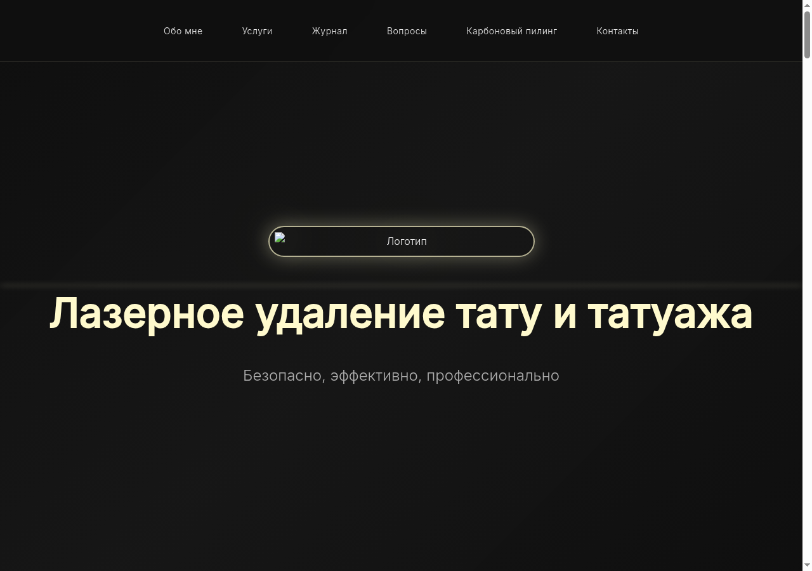
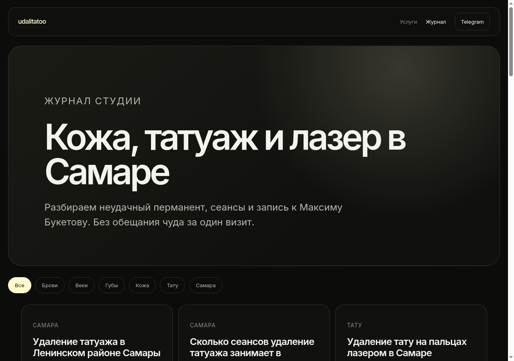
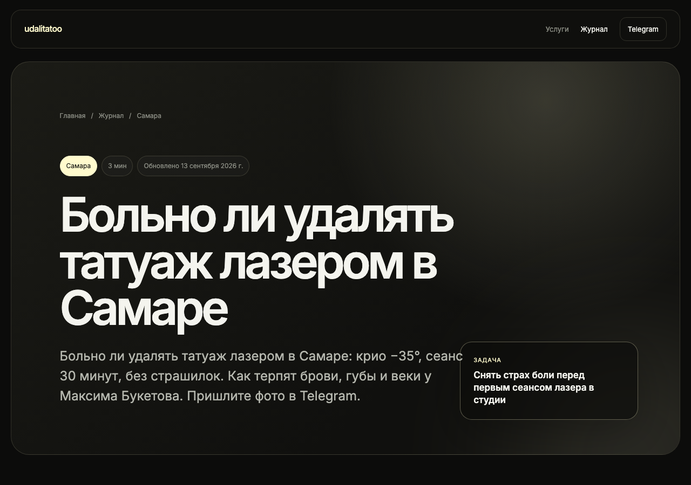
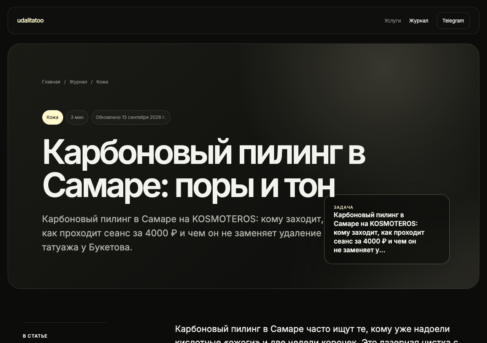

# Udalitatoo — laser removal brand & studio operations

**Udalitatoo** is the digital platform for **Maxim Buketov**’s laser tattoo and permanent-makeup removal studio in Samara ([udalitatoo.ru](https://udalitatoo.ru)): a public marketing site with an SEO journal, a **Learn** portal for students and content admins, and **Buketov** CRM for day-to-day salon operations. Modules share one product story; the main engineering monorepo is private, with **buketov-app** also maintained as its own repository for deploy boundaries. Designed and built by **Alexander** ([asydneysummer](https://github.com/asydneysummer)) for the client brand.

**Production:** [udalitatoo.ru](https://udalitatoo.ru) (landing + journal) · [app.udalitatoo.ru](https://app.udalitatoo.ru) (Buketov CRM) · [learn.udalitatoo.ru](https://learn.udalitatoo.ru) (Learn / blog-cms)

This repository (**[udalitatoo-ecosystem](https://github.com/asydneysummer/udalitatoo-ecosystem)**) is the **public portfolio index** for the Udalitatoo module family. Application source lives in the linked private repos below.

## Features

### Public site (`udalitatoo.ru`)

- **Marketing landing** — hero video, about/services/FAQ/carbon-peeling/location sections, portfolio media, Yandex verification, PWA manifest (`site.webmanifest`)
- **SEO journal** — hundreds of localized articles from Markdown (`content/journal/`), built to static HTML with meta tags, Open Graph, JSON-LD, RSS (`feed.xml`), sitemap and robots updates
- **Journal sync pipeline** — `scripts/journal-sync.mjs` copies posts, renders list/article pages, refreshes sitemap/RSS, and triggers IndexNow (CI + deploy scripts)
- **First-party analytics** — landing beacon (`analytics.js`) sends visitor/session events to public track APIs; aggregated in backend services for admin reports

### Learn / blog-cms (`learn.udalitatoo.ru`)

- **Learning portal** — course modules and materials; invite-only student registration; student dashboard at `/student`
- **Learn admin** — manage modules/materials, students, invite links; analytics routes; admin dashboard with cross-links to CRM site analytics where configured
- **Blog & media API (backend)** — posts, categories, media processing (sharp/ffmpeg), layout templates, optional Telegram cross-post via `TelegramPublisher` (env-gated)
- **Installable PWA** — standalone Learn admin/student UI on dedicated host

### Buketov CRM (`app.udalitatoo.ru`)

- **Appointments** — client booking, master calendar and schedule, appointment history and notifications
- **Clients & masters** — client profiles, master client lists, notes, recommendations, password-setup links for onboarding without an initial password
- **Services & portfolio** — per-master service catalog (price, duration, active flag); portfolio cases and photo uploads; client “my photos”
- **Finance** — payments, expenses, revenue/conversion analytics (role-scoped)
- **Reviews** — client review submission; visibility controls
- **Blog (CRM)** — public `/blog` read; create/edit/publish from master and admin UIs; optional Telegram channel publish and auto-publish
- **Telegram** — bot notifications (scheduler), account linking, channel publishing for blog posts; admin Telegram settings
- **Site & journal analytics** — master/admin dashboards fed by public tracking endpoints from the landing and journal paths
- **Multi-role UX** — `admin`, `master`, and `client` route trees; users with multiple roles can switch in-app (`RoleSwitcher`)

## Screenshots gallery

Portfolio captures of production landing and journal (this index repo).

| Landing (production) | Journal index |
| --- | --- |
|  |  |

| Journal article — procedure | Journal article — carbon peeling |
| --- | --- |
|  |  |

## Roles & capabilities

Capabilities below are evidenced in module source (routes, schema, UI). Auth policies and production toggles live in private repos.

| Role | Surface | Can do |
|------|---------|--------|
| **Guest / public visitor** | [udalitatoo.ru](https://udalitatoo.ru) | Browse landing anchors (`#about`, `#services`, `#faq`, `#recommendations`, `#location`), journal list and articles, RSS; anonymous site/journal analytics events via public track API; no login |
| **Guest / public reader** | [app.udalitatoo.ru](https://app.udalitatoo.ru) `/blog` | Read public CRM blog posts without authentication |
| **Learn admin** | [learn.udalitatoo.ru](https://learn.udalitatoo.ru) | Phone/JWT login; learning modules and materials; students and invite links; analytics admin routes; backend APIs for posts/categories/media and optional Telegram publish when enabled |
| **Learn student** | [learn.udalitatoo.ru](https://learn.udalitatoo.ru) | Register with valid invite; access published learning modules/materials only; redirected to Learn host after login when appropriate |
| **CRM admin** | [app.udalitatoo.ru](https://app.udalitatoo.ru) `/admin/*` | Dashboard; users (create/deactivate/delete); masters; salon-wide finances; payments; expenses; blog management; Telegram settings and connection test; site & journal analytics |
| **CRM master** | [app.udalitatoo.ru](https://app.udalitatoo.ru) `/master/*` | Dashboard; calendar and schedule; services; clients and profiles; portfolio; blog create/manage; own payments, expenses, and financial analytics; site & journal analytics; quick-create clients via API |
| **CRM client** | [app.udalitatoo.ru](https://app.udalitatoo.ru) `/client/*` | Register/login (phone); browse masters; book appointments; view appointments and photos; submit reviews; read public blog |

**Dual CRM roles:** seed and production users may hold both **admin** and **master**; the PWA exposes `availableRoles` and `switchRole` to move between dashboards without re-login.

## Architecture / tech map

```
                         ┌─────────────────────────────────────┐
                         │         udalitatoo.ru (static)       │
                         │  index.html · journal/* · analytics.js │
                         └──────────────┬──────────────────────┘
                                        │ deploy (rsync + GitHub Actions)
┌──────────────────────┐   journal-sync.mjs   ┌────────────────────────────┐
│ content/journal/*.md │ ──────────────────► │ journal/ (HTML, RSS, JSON)  │
└──────────────────────┘                       └────────────────────────────┘
                                        │
                    ┌───────────────────┴───────────────────┐
                    ▼                                       ▼
         ┌─────────────────────┐               ┌─────────────────────┐
         │ blog-cms (Learn)    │               │ buketov-app (CRM)   │
         │ Express · PostgreSQL│               │ Express TS · React  │
         │ learn.udalitatoo.ru │               │ app.udalitatoo.ru   │
         └──────────┬──────────┘               └──────────┬──────────┘
                    │ public track / analytics             │ Telegram bot
                    └──────────────────┬─────────────────────┘
                                       ▼
                          nginx · PM2 · Ubuntu production hosts
```

| Surface | Host | Responsibility |
|---------|------|----------------|
| Landing + journal | `udalitatoo.ru` | Public marketing, SEO journal, client analytics beacon |
| Buketov CRM | `app.udalitatoo.ru` | Admin / master / client operations, CRM blog, finances, Telegram |
| Learn | `learn.udalitatoo.ru` | Learning admin + student cabinet; blog-cms API colocated on Learn vhost |

**Three content channels (by design):** (1) file-based **journal** on the apex domain; (2) CRM **`blog_posts`** on the app host; (3) **blog-cms posts** API on Learn (legacy CMS + Telegram publisher; learning UI is the primary Learn frontend today).

## Key engineering work

- **Markdown → static SEO journal** — `journal-sync.mjs`, `journal-lib.mjs`, and `journal-html.mjs` turn indexed Markdown into static pages, sync assets, rebuild sitemap/RSS, and trigger IndexNow after publish
- **Deploy automation** — `deploy-site.yml` and `deploy-site.sh` run journal sync, rsync landing + `journal/` to production, install `seo-index.mjs`, and maintain search-index cron helpers
- **Cross-property analytics** — landing `analytics.js` (visitor/session IDs, dwell time) plus server-side aggregation and admin-only analytics reports for site and journal performance (CRM and blog-cms backends)
- **Role-based CRM** — JWT auth with refresh; Express `authenticate` / `authorize`; React `ProtectedRoute` for `/client`, `/master`, `/admin`; integration tests for booking, schedule slots, and notifications
- **Appointment & finance domain** — end-to-end appointments, payments, expenses, and analytics services with Jest coverage and SQL-injection/input-validation tests
- **Telegram integration** — minute-interval notification scheduler in CRM; blog auto/manual channel publish; separate `TelegramPublisher` in blog-cms when env flags allow
- **Learn access control** — invite codes; `admin` vs `student` roles; published-only module visibility; host-based redirect (`learn.*`) for student vs admin entry
- **Multi-host nginx layout** — separate vhosts documented for Learn vs CRM; static site deploy path independent of PM2 API processes
- **Portfolio index repo** — this public GitHub index documents the full ecosystem for employers without shipping private application source

## Tech stack

| Layer | Technologies |
|-------|----------------|
| **Runtime** | Node.js 18+ (CI uses 22 for site deploy) |
| **Public site** | Vanilla HTML/CSS/JS; journal build scripts; RSS/sitemap/IndexNow |
| **blog-cms** | Express (ESM), PostgreSQL, JWT, bcrypt, multer/sharp/ffmpeg; React admin PWA; Jest |
| **buketov-app** | Express + TypeScript, PostgreSQL, React 18 + Vite + Tailwind, TanStack Query, React Router, react-big-calendar, date-fns, `node-telegram-bot-api`, Jest |
| **Ops** | GitHub Actions, rsync over SSH, nginx, PM2 (CRM deploy), Let’s Encrypt (documented under module `deployment/`) |

## Repository layout

| Path | Role |
|------|------|
| `README.md` | Public employer-facing ecosystem index (this file) |
| `docs/screenshots/` | Portfolio captures of production landing and journal |

In the private **udalitatoo** monorepo (request access): `index.html` / `style.css` / `script.js` / `analytics.js`, `content/journal/`, generated `journal/`, `scripts/journal-*.mjs`, `blog-cms/`, vendored `buketov-app/` copy, assets under `photos/` / `videos/` / `logos/`, and `.github/workflows/deploy-site.yml`.

## Local setup

There is **no application code** in **udalitatoo-ecosystem**. Clone private module repos and use each `.env.example` (never commit real secrets).

**Journal build only (no database):**

```bash
node scripts/journal-sync.mjs
# Output under journal/; updates sitemap.xml and RSS
```

**Learn / blog-cms** — see `blog-cms/QUICKSTART.md` in **udalitatoo**:

```bash
cd blog-cms/backend
npm install
cp .env.example .env   # DB_*, JWT_SECRET; optional TELEGRAM_* placeholders
npm run migrate
npm start
```

**CRM (buketov-app)** — see `buketov-app/README.md`:

```bash
npm run install:all
# PostgreSQL: create DB and load database/schema.sql (+ migrations as needed)
cp backend/.env.example backend/.env
cp frontend/.env.example frontend/.env   # VITE_API_URL for local API
npm run dev:backend   # default http://localhost:3000
npm run dev:frontend  # default http://localhost:5173
```

| Module | Repository |
|--------|------------|
| Landing + journal + blog-cms monorepo | [udalitatoo](https://github.com/asydneysummer/udalitatoo) *(private — request access)* |
| Canonical CRM | [buketov-app](https://github.com/asydneysummer/buketov-app) *(private — request access)* |

## Related repositories

| Module | Repository | Production |
|--------|------------|------------|
| **Site** — landing, journal pipeline, blog-cms sources | [udalitatoo](https://github.com/asydneysummer/udalitatoo) *(private — request access)* | [udalitatoo.ru](https://udalitatoo.ru), [udalitatoo.ru/journal/](https://udalitatoo.ru/journal/) |
| **Buketov CRM** — appointments, clients, finance, CRM blog, Telegram | [buketov-app](https://github.com/asydneysummer/buketov-app) *(private — request access)* | [app.udalitatoo.ru](https://app.udalitatoo.ru) |
| **Learn** — training admin & student cabinet (frontend on Learn host) | Same monorepo: `blog-cms/` in **udalitatoo** | [learn.udalitatoo.ru](https://learn.udalitatoo.ru) |

*Private portfolio index · request access to module source repos · client: Maxim Buketov / udalitatoo.ru · author: Alexander / [asydneysummer](https://github.com/asydneysummer)*

---

# Udalitatoo — бренд студии и операционная экосистема

**Udalitatoo** — цифровая платформа студии лазерного удаления тату и татуажа **Максима Букетова** в Самаре ([udalitatoo.ru](https://udalitatoo.ru)): публичный маркетинговый сайт с SEO-журналом, портал **Learn** для учеников и админов контента и CRM **Buketov** для ежедневной работы салона. Модули связаны одной продуктовой историей; основной инженерный monorepo приватный, **buketov-app** также ведётся отдельным репозиторием для границ деплоя. Проектирование и разработка: **Александр** ([asydneysummer](https://github.com/asydneysummer)) для клиентского бренда.

**Продакшен:** [udalitatoo.ru](https://udalitatoo.ru) (лендинг + журнал) · [app.udalitatoo.ru](https://app.udalitatoo.ru) (CRM Buketov) · [learn.udalitatoo.ru](https://learn.udalitatoo.ru) (Learn / blog-cms)

Этот репозиторий (**[udalitatoo-ecosystem](https://github.com/asydneysummer/udalitatoo-ecosystem)**) — **публичный портфолио-индекс** семейства модулей Udalitatoo. Исходный код приложений — в связанных приватных репозиториях ниже.

## Возможности

### Публичный сайт (`udalitatoo.ru`)

- **Маркетинговый лендинг** — hero-видео, блоки «обо мне / услуги / FAQ / карбоновый пилинг / контакты», медиа портфолио, верификация Яндекса, PWA-манифест (`site.webmanifest`)
- **SEO-журнал** — сотни локализованных статей из Markdown (`content/journal/`), сборка в статический HTML с meta, Open Graph, JSON-LD, RSS (`feed.xml`), обновление sitemap и robots
- **Pipeline журнала** — `scripts/journal-sync.mjs` копирует посты, рендерит список и статьи, обновляет sitemap/RSS и дергает IndexNow (CI + deploy-скрипты)
- **Собственная аналитика** — маяк на лендинге (`analytics.js`) отправляет события visitor/session на публичные track API; агрегация в backend для отчётов админов

### Learn / blog-cms (`learn.udalitatoo.ru`)

- **Портал обучения** — модули и материалы курсов; регистрация учеников только по инвайту; кабинет ученика `/student`
- **Админ Learn** — управление модулями/материалами, учениками, инвайт-ссылками; маршруты аналитики; дашборд с перекрёстными ссылками на аналитику сайта в CRM где настроено
- **Blog & media API (backend)** — посты, категории, медиа (sharp/ffmpeg), шаблоны вёрстки, опциональный кросс-пост в Telegram через `TelegramPublisher` (по env-флагам)
- **Устанавливаемый PWA** — отдельный хост для UI админа и ученика Learn

### CRM Buketov (`app.udalitatoo.ru`)

- **Записи** — бронирование клиентом, календарь и расписание мастера, история визитов и уведомления
- **Клиенты и мастера** — профили клиентов, списки у мастера, заметки, рекомендации, ссылки установки пароля для онбординга без начального пароля
- **Услуги и портфолио** — каталог услуг мастера (цена, длительность, активность); кейсы портфолио и загрузка фото; «мои фото» у клиента
- **Финансы** — платежи, расходы, аналитика выручки/конверсии (по ролям)
- **Отзывы** — отправка отзыва клиентом; управление видимостью
- **Блог (CRM)** — публичное чтение `/blog`; создание/редактирование/публикация из UI мастера и админа; опциональная публикация в Telegram-канал и автопост
- **Telegram** — уведомления бота (планировщик), привязка аккаунта, публикация постов блога в канал; настройки Telegram у админа
- **Аналитика сайта и журнала** — дашборды master/admin на данных публичных track endpoint с лендинга и путей журнала
- **Multi-role UX** — деревья маршрутов `admin`, `master`, `client`; переключение ролей в приложении (`RoleSwitcher`) для пользователей с несколькими ролями

## Галерея скриншотов

Снимки продакшен-лендинга и журнала для портфолио (этот index-репозиторий).

| Лендинг (прод) | Индекс журнала |
| --- | --- |
|  |  |

| Статья журнала — процедура | Статья журнала — карбоновый пилинг |
| --- | --- |
|  |  |

## Роли и возможности

Ниже — возможности, подтверждённые исходниками (маршруты, схема, UI). Политики auth и прод-флаги — в приватных репозиториях.

| Роль | Площадка | Может |
|------|----------|--------|
| **Гость / публичный посетитель** | [udalitatoo.ru](https://udalitatoo.ru) | Лендинг и якоря (`#about`, `#services`, `#faq`, `#recommendations`, `#location`), список и статьи журнала, RSS; анонимные события аналитики сайта/журнала через public track API; без входа |
| **Гость / читатель блога** | [app.udalitatoo.ru](https://app.udalitatoo.ru) `/blog` | Читать публичные посты CRM-блога без авторизации |
| **Админ Learn** | [learn.udalitatoo.ru](https://learn.udalitatoo.ru) | Вход phone/JWT; модули и материалы обучения; ученики и инвайты; admin-маршруты аналитики; backend API постов/категорий/медиа и опциональный Telegram-пост при включённых env |
| **Ученик Learn** | [learn.udalitatoo.ru](https://learn.udalitatoo.ru) | Регистрация по валидному инвайту; только опубликованные модули/материалы; после входа редирект на хост Learn при необходимости |
| **Админ CRM** | [app.udalitatoo.ru](https://app.udalitatoo.ru) `/admin/*` | Дашборд; пользователи (создание/деактивация/удаление); мастера; финансы салона; платежи; расходы; управление блогом; настройки и тест Telegram; аналитика сайта и журнала |
| **Мастер CRM** | [app.udalitatoo.ru](https://app.udalitatoo.ru) `/master/*` | Дашборд; календарь и расписание; услуги; клиенты и карточки; портфолио; создание/ведение блога; свои платежи, расходы и финаналитика; аналитика сайта и журнала; быстрое создание клиентов через API |
| **Клиент CRM** | [app.udalitatoo.ru](https://app.udalitatoo.ru) `/client/*` | Регистрация/вход (телефон); выбор мастеров; запись; свои визиты и фото; отзывы; публичный блог |

**Две CRM-роли:** у пользователя могут быть одновременно **admin** и **master**; PWA даёт `availableRoles` и `switchRole` для смены дашборда без повторного входа.

## Архитектура / карта технологий

```
                         ┌─────────────────────────────────────┐
                         │         udalitatoo.ru (статика)      │
                         │  index.html · journal/* · analytics.js │
                         └──────────────┬──────────────────────┘
                                        │ deploy (rsync + GitHub Actions)
┌──────────────────────┐   journal-sync.mjs   ┌────────────────────────────┐
│ content/journal/*.md │ ──────────────────► │ journal/ (HTML, RSS, JSON)  │
└──────────────────────┘                       └────────────────────────────┘
                                        │
                    ┌───────────────────┴───────────────────┐
                    ▼                                       ▼
         ┌─────────────────────┐               ┌─────────────────────┐
         │ blog-cms (Learn)    │               │ buketov-app (CRM)   │
         │ Express · PostgreSQL│               │ Express TS · React  │
         │ learn.udalitatoo.ru │               │ app.udalitatoo.ru   │
         └──────────┬──────────┘               └──────────┬──────────┘
                    │ public track / analytics             │ Telegram bot
                    └──────────────────┬─────────────────────┘
                                       ▼
                          nginx · PM2 · Ubuntu (прод-хосты)
```

| Площадка | Хост | Зона ответственности |
|----------|------|----------------------|
| Лендинг + журнал | `udalitatoo.ru` | Публичный маркетинг, SEO-журнал, клиентский маяк аналитики |
| CRM Buketov | `app.udalitatoo.ru` | admin / master / client, CRM-блог, финансы, Telegram |
| Learn | `learn.udalitatoo.ru` | Админ обучения + кабинет ученика; API blog-cms на том же vhost |

**Три канала контента:** (1) файловый **журнал** на apex-домене; (2) **`blog_posts` CRM** на app-хосте; (3) **posts blog-cms** на Learn (legacy CMS + Telegram publisher; основной UI Learn сегодня — обучение).

## Ключевая инженерная работа

- **Markdown → статический SEO-журнал** — `journal-sync.mjs`, `journal-lib.mjs`, `journal-html.mjs`: Markdown в статические страницы, sync ассетов, sitemap/RSS, IndexNow после публикации
- **Автоматизация деплоя** — `deploy-site.yml` и `deploy-site.sh`: sync журнала, rsync лендинга и `journal/` на прод, `seo-index.mjs`, cron для поисковой индексации
- **Сквозная аналитика** — `analytics.js` на лендинге (visitor/session, dwell time) плюс серверная агрегация и admin-отчёты по сайту и журналу (backend CRM и blog-cms)
- **Role-based CRM** — JWT и refresh; Express `authenticate` / `authorize`; React `ProtectedRoute` для `/client`, `/master`, `/admin`; интеграционные тесты записи, слотов расписания и уведомлений
- **Домен записей и финансов** — appointments, payments, expenses, analytics-сервисы; Jest; тесты SQL-injection и валидации ввода
- **Интеграция Telegram** — минутный scheduler уведомлений в CRM; авто/ручная публикация блога в канал; отдельный `TelegramPublisher` в blog-cms по env
- **Контроль доступа Learn** — инвайт-коды; роли `admin` / `student`; ученик видит только опубликованные модули; редирект по хосту (`learn.*`)
- **Multi-host nginx** — отдельные vhost для Learn и CRM; статика сайта деплоится независимо от PM2 API-процессов
- **Портфолио-index** — этот публичный GitHub-репозиторий описывает экосистему для работодателей без выкладки приватного кода приложений

## Стек технологий

| Слой | Технологии |
|------|------------|
| **Runtime** | Node.js 18+ (CI: 22 для деплоя сайта) |
| **Публичный сайт** | HTML/CSS/JS; скрипты сборки журнала; RSS/sitemap/IndexNow |
| **blog-cms** | Express (ESM), PostgreSQL, JWT, bcrypt, multer/sharp/ffmpeg; React admin PWA; Jest |
| **buketov-app** | Express + TypeScript, PostgreSQL, React 18 + Vite + Tailwind, TanStack Query, React Router, react-big-calendar, date-fns, `node-telegram-bot-api`, Jest |
| **Ops** | GitHub Actions, rsync по SSH, nginx, PM2 (деплой CRM), Let’s Encrypt (в `deployment/` модулей) |

## Структура репозитория

| Путь | Назначение |
|------|------------|
| `README.md` | Публичный employer-facing индекс экосистемы (этот файл) |
| `docs/screenshots/` | Скриншоты прод-лендинга и журнала для портфолио |

В приватном monorepo **udalitatoo** (запрос доступа): `index.html` / `style.css` / `script.js` / `analytics.js`, `content/journal/`, собранный `journal/`, `scripts/journal-*.mjs`, `blog-cms/`, копия `buketov-app/`, ассеты `photos/` / `videos/` / `logos/`, `.github/workflows/deploy-site.yml`.

## Локальный запуск

В **udalitatoo-ecosystem** **нет кода приложений**. Клонируйте приватные модули и используйте `.env.example` (не коммитьте реальные секреты).

**Только сборка журнала (без БД):**

```bash
node scripts/journal-sync.mjs
# Результат в journal/; обновляет sitemap.xml и RSS
```

**Learn / blog-cms** — `blog-cms/QUICKSTART.md` в **udalitatoo**:

```bash
cd blog-cms/backend
npm install
cp .env.example .env   # DB_*, JWT_SECRET; опционально TELEGRAM_* — плейсхолдеры
npm run migrate
npm start
```

**CRM (buketov-app)** — `buketov-app/README.md`:

```bash
npm run install:all
# PostgreSQL: создать БД и загрузить database/schema.sql (+ миграции по необходимости)
cp backend/.env.example backend/.env
cp frontend/.env.example frontend/.env   # VITE_API_URL для локального API
npm run dev:backend   # по умолчанию http://localhost:3000
npm run dev:frontend  # по умолчанию http://localhost:5173
```

| Модуль | Репозиторий |
|--------|-------------|
| Лендинг + журнал + monorepo blog-cms | [udalitatoo](https://github.com/asydneysummer/udalitatoo) *(приватный — запросите доступ)* |
| Канонический CRM | [buketov-app](https://github.com/asydneysummer/buketov-app) *(приватный — запросите доступ)* |

## Связанные репозитории

| Модуль | Репозиторий | Продакшен |
|--------|-------------|-----------|
| **Сайт** — лендинг, pipeline журнала, исходники blog-cms | [udalitatoo](https://github.com/asydneysummer/udalitatoo) *(приватный — запросите доступ)* | [udalitatoo.ru](https://udalitatoo.ru), [udalitatoo.ru/journal/](https://udalitatoo.ru/journal/) |
| **CRM Buketov** — записи, клиенты, финансы, CRM-блог, Telegram | [buketov-app](https://github.com/asydneysummer/buketov-app) *(приватный — запросите доступ)* | [app.udalitatoo.ru](https://app.udalitatoo.ru) |
| **Learn** — админ обучения и кабинет ученика (frontend на Learn-хосте) | Тот же monorepo: `blog-cms/` в **udalitatoo** | [learn.udalitatoo.ru](https://learn.udalitatoo.ru) |

*Портфолио-index · запросите доступ к исходникам модулей · клиент: Максим Букетов / udalitatoo.ru · автор: Александр / [asydneysummer](https://github.com/asydneysummer)*
